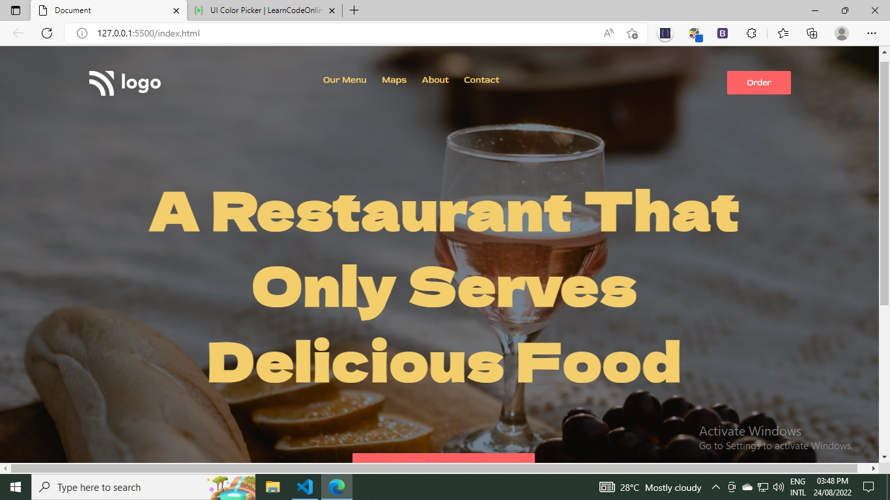

# Hi, This is Torjuman Rimon.

I design a website's home page. It is a home page which is most like "Food Restaurant Home Page". It is one of the live class project from iNeuron's Full Stack JavaScript Bootcamp given by **[Hitesh Sir](https://github.com/hiteshchoudhary)**

## Image from this project

All the images, icons and HTML file was given to me. And I need to make this landing page as it was instructed.

- **What I have learnd in this project**

  - Background image controling in CSS
  - Linear gradient colour setup

- **Time needed to finish this project**

  - 3:00 hours

- **Challenges**

  - Not use Flex
  - Not use Grid
  - Just use Position

- **[Live Link](https://tr-food-restaurant-home-page.netlify.app/)**

